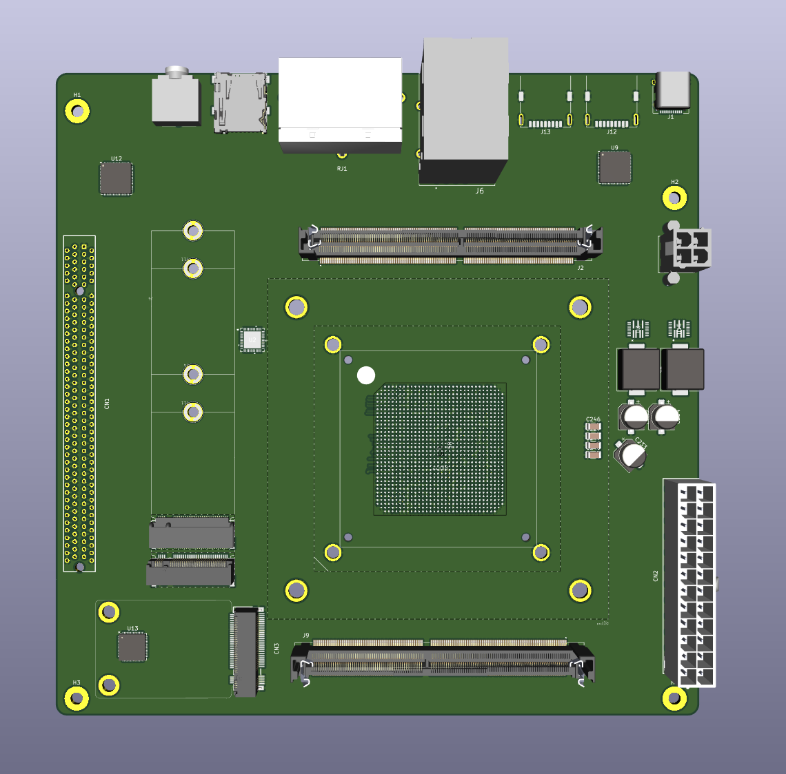

# d2000-bugboard
This is an open source, hackable mITX board feauturing the Phytium D2000 ARM CPU. It is intended to provide the best possible platform for anyone who might be interested in domestic Chinese silicon, and how far its come. It is currently very WIP, but is moving along nicely :) 

* Very WIP Kicad render

# Specs:
* Phytium D2000 CPU
    * 8x FTC663 cores at 2.6GHz with 4MB l3
* 2x DDR4-2666 DDR4 SODIMM sockets
* Full PCIe 3.0 x16 link, with support for a GPU
* 2x M.2 M-key NVMe sockets
* 3x 1Gbe ethernet interfaces
* UEFI firmware
* USB 3.0 + USB 2.0, both internally and externally
* UART, SPI, and CANBUS all broken out
* JTAG header
* Reimplementation of CPLD via an RP2350b on a spec-defiant M.2 M-key connector to allow for a completely open source embedded controller
    * UART, CANBUS, SPI, and GPIO available on the socket to allow for a variety of possible daughterboards
* 2x Fan headers with PWM control (Planned)
* ATX + planned USB-C PD 20V/5A support

## To-do:
* Finalize schematics
* Figure out illegal pinout for EC M.2 connector
    * Design board, and figure out best ways to prevent port or module being used elsewhere and causing damage
* Finalize board layout and stop swapping USB port designs
* Routing for:
    * PCIe
    * DDR4 sockets
    * CPU VCORE
* Figure out the best connectors for breaking out I/O to keep it "standard"
* Triple check mITX specs for PCIe slot layout

# More info:
Hi, I am moth. I like designing weird hardware, and this is probably the weirdest I have designed yet.  I really love these weird Chinese CPUs, and have been working with them for a few years at this point, and producing my own mITX board to my own specification has long been a goal of mine. Thanks for checking out my attempt :)

Phytium unhelpfully does not like to share a lot of information, but I have scraped together a lot of it over [here](https://wiki.slop.gay/Phytium/D2000) on my personal wiki. 

A huge thank you to [wifi](https://github.com/a-little-wifi/) for the advice and help, and everyone else in Hackmods:3 
